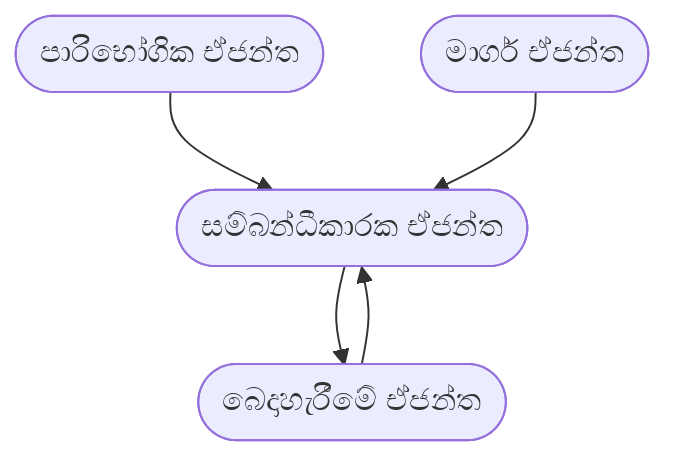

# වයඹ පළාත් අධ්‍යාපන දෙපාර්තමේන්තුව
## තෙවන වාර පරීක්ෂණය - 13 ශ්‍රේණිය - 2026
### තොරතුරු හා සන්නිවේදන තාක්ෂණය - II (පිළිතුරු පත්‍රය)

---

## A කොටස - ව්‍යුහගත රචනා

### ප්‍රශ්නය 1

**(a) (i) ඉහත HTML පෝරමයේ අන්තර්ගත 4 වෙනි පේළිය "රෝගී ලියාපදිංචි පෝරමය" යන මාතෘකාව සඳහා දී ඇති අවශ්‍යතා සපුරාලන පරිදි බාහිර විලාස පතක් (external CSS) ලියන්න.**
* **වරකය (Selector)** :- `h2`
* **විලාස විස්තරය** :- අක්ෂරවල විශාලත්වය - 16px, අක්ෂර වර්ණය - red, පාඨ එකෙල්ල වීම - center

**පිළිතුර:**
```css
h2 {
    font-size: 16px;
    color: red;
    text-align: center;
}
```

**(ii) ඉහත (a) හි අර්ථ දක්වන ලද බාහිර විලාස පත, index.php ගොනුවට සම්බන්ධ කිරීමට අදාළ HTML කේතය ලියන්න.**
**පිළිතුර:**
```html
<link rel="stylesheet" type="text/css" href="style1.css">
```

**(b) Patient වගුව නිර්මාණය කිරීම සඳහා SQL ප්‍රකාශය ලියන්න.**
**පිළිතුර:**
```sql
CREATE TABLE Patient (
    P_ID int NOT NULL,
    P_Name varchar(255) NOT NULL,
    Gender char(1) NOT NULL,
    Age int NOT NULL,
    Contact_No char(10) NOT NULL,
    PRIMARY KEY (P_ID)
);
```

**(c) "Index.php" ගොනුවේ අන්තර්ගත php කේතයේ හිස්තැන් සඳහා අදාළ ආදේශකයේ අංකය ලියා දක්වන්න.**
**පිළිතුර:**
* පළමු කොටුව (`$conn = new mysqli(...)` හි පළමු පරාමිතිය): **4** (`$servername`)
* දෙවන කොටුව (`$conn = new mysqli(...)` හි අවසන් පරාමිතිය): **2** (`$dbname`)
* තෙවන කොටුව (සම්බන්ධතාවය පරීක්ෂා කිරීමේ දී දෝෂයක් ආ විට): **5** (`die`)
* හතරවන කොටුව (`$conn->query(...) == TRUE`): **7** (`$sql`)

---

### ප්‍රශ්නය 2

**(a) (i) ඉහත එක් එක් A, B, C සහ D ක්‍රියාකාරකම සඳහා ඉවහල් වූ මෘදුකාංග පරීක්ෂා ක්‍රමය ලියා දක්වන්න.**
**පිළිතුර:**
* **A ක්‍රියාකාරකම:** භාර පරීක්ෂාව (Load testing) හෝ ක්‍රියාකාරීත්ව පරීක්ෂාව (Performance testing)
* **B ක්‍රියාකාරකම:** පරිශීලක ප්‍රතිග්‍රහණ පරීක්ෂාව (User Acceptance Testing - UAT) හෝ පද්ධති පරීක්ෂාව (System testing)
* **C ක්‍රියාකාරකම:** ඒකක පරීක්ෂාව (Unit testing)
* **D ක්‍රියාකාරකම:** අනුකලන පරීක්ෂාව (Integration testing)

**(ii) සෘජු ස්ථාපනය සහ සමාන්තර ස්ථාපනය යන ස්ථාපන ක්‍රම අතරින් MediCare සඳහා ඔබ නිර්දේශ කරන්නේ කුමන ක්‍රමය ද? එම නිර්දේශය සඳහා හේතු දෙකක් දක්වන්න.**
**පිළිතුර:**
* **ස්ථාපනය ක්‍රමය:** සමාන්තර ස්ථාපනය (Parallel Installation)
* **හේතු:**
  1. දත්ත අහිමි වීමේ අවදානම අවම වීම සහ රෝගී දත්ත ඉතා වැදගත් වීම.
  2. තාක්ෂණික දෝෂයක් මතු වුවහොත් පැරණි ක්‍රමය ඔස්සේ රෝගී සත්කාර කටයුතු ප්‍රමාදයකින් තොරව අඛණ්ඩව කරගෙන යාමට හැකි වීම.

**(iii) මූලික තොරතුරු තාක්ෂණ සාක්ෂරතාව නොමැතිකම සහ පද්ධතිය අකර්මණ්‍ය වේ යැයි බිය අවම කර පද්ධතිය සාර්ථකව භාවිතයට ගැනීම සඳහා ස්ථාපන අදියරේ දී ගත හැකි ප්‍රායෝගික පියවරක් යෝජනා කරන්න.**
**පිළිතුර:**
කාර්ය මණ්ඩලයට නව පද්ධතිය භාවිතය පිළිබඳව ප්‍රායෝගික පුහුණු සැසි (Training sessions) පැවැත්වීම සහ පරිශීලක අත්පොත් (User manuals) ලබා දීම.

**(iv) සම්මත ව්‍යාපාරික යෙදවුමක් භාවිතයට ගැනීමට තීරණය කර ඇත. විශාල පිරිවැයක් දැරීමට සිදු වුවත් එම තීරණය සඳහා හේතු විය හැකි කරුණු දෙකක් ලියන්න.**
**පිළිතුර:**
1. සායනයේ පවතින සුවිශේෂී අවශ්‍යතාවයන්ට හරියටම ගැලපෙන පරිදි පද්ධතිය සකස් කර ගත හැකි වීම.
2. අනවශ්‍ය උපාංග හෝ මොඩියුල නොමැති වීම නිසා පද්ධතියේ කාර්යක්ෂමතාව ඉහළ වීම.

**(b) ලබා දී ඇති ER රූපසටහන සම්බන්ධතා පරිපාටික සටහනකට අනුරූපණය කරන්න.**
**පිළිතුර:**
* Employee(<u>EID</u>, EmName, Address, DOB)
* Emp_Degree(<u>EID</u>, <u>Degree</u>)
* Dependent(<u>EID</u>, <u>DepName</u>, Relationship, DOB)

---

### ප්‍රශ්නය 3

**(a) ගැලීම් සටහනෙන් ලැබෙන ප්‍රතිදානයන් හි A, B සහ C හිස් තැන් සඳහා සුදුසු අගයන් ලියන්න.**
**පිළිතුර:**
* A - **3**
* B - **4**
* C - **5**

**(b) (i) A සිට D දක්වා ලේබල සඳහා සුදුසු කේත කොටස් පහත කොටුව තුළ ඇති ලේබල ඉදිරියෙන් ලියන්න.**
**පිළිතුර:**
* A - `i <= 3:`
* B - `num`
* C - `j = j + 1` (හෝ `j += 1`)
* D - `i = i + 1` (හෝ `i += 1`)

**(ii) දී ඇති අසම්පූර්ණ පයිතන් ක්‍රමලේඛයේ P සිට S තෙක් හිස් තැන් සඳහා සුදුසු විධාන, දී ඇති පද ලැයිස්තුවෙන් තෝරා ලියන්න.**
**පිළිතුර:**
* P - `while i<=4:`
* Q - `print(j, end="")`
* R - `print()`
* S - `i+=1`

---

### ප්‍රශ්නය 4

**(a) (i) පහත සිද්ධි හේතුවෙන්, ක්‍රියායන පත්වන තත්ත්වය ලියන්න.**
**පිළිතුර:**
* PA ක්‍රියායනය සඳහා ලබා දුන් කාලය අවසන් වීම: **ධාවන තත්ත්වයේ සිට සූදානම් තත්ත්වයට (Running to Ready)**
* PB ක්‍රියායනයට වඩා ප්‍රමුඛතාවය වැඩි ක්‍රියායනයක් පැමිණීම: **ධාවන තත්ත්වයේ සිට සූදානම් තත්ත්වයට (Running to Ready)**
* PC ක්‍රියායනය මගින් ගොනුවක් කියවීම: **ධාවන තත්ත්වයේ සිට අවහිර වූ තත්ත්වයට (Running to Blocked/Waiting)**
* PD ක්‍රියායනය සම්පූර්ණයෙන් ක්‍රියාත්මක වී අවසන් වීම: **ධාවන තත්ත්වයේ සිට අවසන් කළ තත්ත්වයට (Running to Terminated)**

**(ii) PCB හි ඇති තොරතුරු අතරින් නැවැත්වූ තැන සිට පටන් ගැනීම සඳහා ප්‍රමුඛ වන තොරතුර කුමක්ද?**
**පිළිතුර:** ක්‍රමලේඛ ගණකය (Program Counter)

**(b) (i) මතක සම්පත් ලබා ගැනීමේ දී සිදුවන කාර්යයක් ලියන්න.**
**පිළිතුර:** ක්‍රියායනයට වෙන් කර තිබූ මතක රාමු නැවත නිදහස් කිරීම සහ පිටු වගුව යාවත්කාලීන කිරීම (Freeing memory frames and updating page table).

**(ii) මෙලෙස මතක සම්පත් නැවත පවරා ගැනීමේ වාසිය කුමක්ද?**
**පිළිතුර:** වෙනත් නව ක්‍රියායනයකට හෝ පවතින ක්‍රියායනයකට ක්‍රියාත්මක වීම සඳහා අමතර මතක ඉඩ ප්‍රමාණයක් (නිදහස් මතකයක්) ලබා දීමට හැකි වීම.

**(c) (i) අතථ්‍ය මතකයේ විශාලත්වය කොපමණ ද?**
**පිළිතුර:** අතථ්‍ය යොමුව බිටු 17ක් බැවින්, 2^17 යොමු පවතී. (2^17 බයිට/වචන).

**(ii) අතථ්‍ය යොමුව අනුරූපණය වන බිටු 16කින් යුත් භෞතික යොමුව කුමක්ද?**
**පිළිතුර:**
අතථ්‍ය යොමුව `0 0100 1111 0000 1111` වේ.
පිටු අංකය සඳහා පළමු බිටු 5 වෙන් කළ විට, එය `00100` (4 වන පිටුව) වේ.
වගුවට අනුව 4 වන පිටුවේ රාමු අංකය `0101` වේ.
ඉතිරි බිටු 12 (`1111 0000 1111`) විස්ථාපනය (offset) වේ.
එමනිසා භෞතික යොමුව: **`0101 1111 0000 1111`**

**(iii) මෙහෙයුම් පද්ධතියට ද්විතියික ආචයනයේ සිට භෞතික මතකයට අදාළ පිටුව ගෙන ඒමට අවශ්‍ය වන X ක්‍රියායනයේ එක් අතථ්‍ය යොමුවක්, ඉහත දක්වා ඇති පිටු වගුවෙන් පමණක් තෝරා ලියා දක්වන්න.**
**පිළිතුර:** වලංගුතාව 0 වන පිටුවක් සඳහා යොමුවක් විය යුතුය. (උදා: 2 වන පිටුවට අදාළ ඕනෑම යොමුවක්).
**`00010 0000 0000 0000`** (හෝ 2 හෝ 3 වන පිටුවට අයත් ඕනෑම බිටු රටාවක්).

**(d) වගුව සම්පූර්ණ කිරීම සහ අවාසි ලිවීම.**
**පිළිතුර:**
| පරිගණකය | භාවිත වන කාණ්ඩ ගණන | අභ්‍යන්තර ඛණ්ඩනීකරණය |
|---|---|---|
| A | 219 | 1 KB |
| B | 7 | 21 KB |

* **A පරිගණකය අවාසිය:** විශාල කාණ්ඩ ගණනක් කළමනාකරණය කිරීමට සිදු වීම (More blocks to manage, higher overhead).
* **B පරිගණකය අවාසිය:** අභ්‍යන්තර ඛණ්ඩනීකරණය ඉහළ වීම නිසා වැඩි මතක ප්‍රමාණයක් අපතේ යාම (High internal fragmentation).

---

## B කොටස

### ප්‍රශ්නය 5

**(a) බූලීය වීජ ගණිත භාවිතයෙන්, A'BC + A'BC' + A'B'C + A'B'C' + ABC = A' + BC බව සාධනය කරන්න.**
**පිළිතුර:**
= A'BC + A'BC' + A'B'C + A'B'C' + ABC
= A'B(C + C') + A'B'(C + C') + ABC
= A'B(1) + A'B'(1) + ABC
= A'B + A'B' + ABC
= A'(B + B') + ABC
= A'(1) + ABC
= A' + ABC
= (A' + A) . (A' + BC)  *(බෙදාහැරීමේ නියමය / Distributive Law)*
= 1 . (A' + BC)
= A' + BC (සාධනය කරන ලදි)

**(b) (i) හරිතාගාර ජල සැපයුම් ස්වයංක්‍රීය පද්ධතියේ ක්‍රියාකාරිත්වය දැක්වීමට සත්‍යතා වගුව ගොඩනගන්න.**
**පිළිතුර:**
පද්ධතිය ක්‍රියාත්මක වීමේ කොන්දේසිය (X = 1): D=0 සහ C=1 සහ (A=1 හෝ B=1)
(D=0: අත්යුරු ජල සැපයුම නැත, C=1: ජලය තිබීම, B=1: අධික උණුසුම, A=1: පස වියළියි)

| A | B | C | D | X |
|---|---|---|---|---|
| 0 | 0 | 0 | 0 | 0 |
| 0 | 0 | 0 | 1 | 0 |
| 0 | 0 | 1 | 0 | 0 |
| 0 | 0 | 1 | 1 | 0 |
| 0 | 1 | 0 | 0 | 0 |
| 0 | 1 | 0 | 1 | 0 |
| 0 | 1 | 1 | 0 | 1 |
| 0 | 1 | 1 | 1 | 0 |
| 1 | 0 | 0 | 0 | 0 |
| 1 | 0 | 0 | 1 | 0 |
| 1 | 0 | 1 | 0 | 1 |
| 1 | 0 | 1 | 1 | 0 |
| 1 | 1 | 0 | 0 | 0 |
| 1 | 1 | 0 | 1 | 0 |
| 1 | 1 | 1 | 0 | 1 |
| 1 | 1 | 1 | 1 | 0 |

**(ii) කානෝ සිතියම භාවිතයෙන් ඉහත පද්ධතියේ ක්‍රියාකාරිත්වය සඳහා සරලතම ගුණිතයන්ගේ ඓක්‍යය (SOP) ප්‍රකාශනය ව්‍යුත්පන්න කරන්න.**
**පිළිතුර:**
X = A B' C D' + A' B C D' + A B C D'
සරල කිරීමෙන් පසු ලැබෙන SOP ප්‍රකාශනය: **X = A C D' + B C D'**

**(iii) NAND ද්වාර පමණක් භාවිත කර ඉහත (ii) හි ලබා ගත් සරලතම ප්‍රකාශනය සඳහා තාර්කික පරිපථය ඇඳ දක්වන්න.**
**පිළිතුර:**
ප්‍රකාශනය: X = ACD' + BCD'
NAND බවට පරිවර්තනය: X = ( (ACD')' . (BCD')' )'
*(සටහන: මෙහිදී A, C, D' ආදාන ලබා දෙන එක් NAND ද්වාරයක් ද, B, C, D' ආදාන ලබාදෙන තවත් NAND ද්වාරයක් ද භාවිත කර, එම ද්වාර දෙකෙහි ප්‍රතිදාන අවසන් NAND ද්වාරයට ලබා දිය යුතුය. D සඳහා NOT ද්වාරයක් වෙනුවට ආදාන දෙකම එකට සම්බන්ධ කළ NAND ද්වාරයක් යොදා ගත හැක.)*

**(iv) සරලතම බූලීය ප්‍රකාශනය භාවිත කර මෙම ස්වයංක්‍රිය පද්ධතිය නිර්මාණය කිරීමේ වාසි 02ක් ලියන්න.**
**පිළිතුර:**
1. පරිපථය සඳහා වැය වන දෘඪාංග වියදම (Hardware cost) අඩු වීම.
2. පරිපථයේ සංකීර්ණතාවය අඩුවීම නිසා එහි කාර්යක්ෂමතාව සහ විශ්වසනීයත්වය (Reliability) ඉහළ යාම.

---

### ප්‍රශ්නය 6

**(a) ඡේදයේ A,B සහ C ලෙස ලේබල් කර ඇති හිස් තැන් සඳහා සුදුසු ආදේශක ලියා දක්වන්න.**
**පිළිතුර:**
* A - **TCP**
* B - **HTTP**
* C - **HTTPS**

**(b) පහත දැක්වෙන නියමාවලි ක්‍රියාත්මක වන TCP/IP ආකෘතියේ අදාළ ස්තර නම් කරන්න.**
**පිළිතුර:**
* (i) HTTP/FTP - **යෙදුම් ස්තරය (Application Layer)**
* (ii) IP/ICMP - **අන්තර්ජාල ස්තරය (Internet Layer)**
* (iii) TCP/UDP - **ප්‍රවාහන ස්තරය (Transport Layer)**

**(c) MAC ලිපිනය සහ IPv4 ලිපිනය අතර පවතින වෙනස්කම් 03 ක් ලියන්න.**
**පිළිතුර:**
1. MAC ලිපිනය යනු දෘඪාංග ලිපිනයක් (Physical address) වන අතර, IP ලිපිනය යනු තාර්කික ලිපිනයකි (Logical address).
2. MAC ලිපිනය බිටු 48 කින් සමන්විත වන අතර, IPv4 ලිපිනය බිටු 32 කින් සමන්විත වේ.
3. MAC ලිපිනය ෂඩ්දශමක (Hexadecimal) ආකෘතියෙන් දක්වන අතර, IPv4 ලිපිනය දශමක (Decimal) ආකෘතියෙන් දක්වයි.
4. MAC ලිපිනය ස්ථිර (ස්ථාවර) වන අතර වෙනස් කළ නොහැක, නමුත් IP ලිපිනය ගතිකව වෙනස් කළ හැක (Dynamic).

**(d) සෘජු ලක්ෂ්‍යය ස්ථලකයට (Point-to-Point) අනුව පරිගණක දෙක අතර සම්බන්ධතාවය පෙන්වන ජාල රූපසටහනක් අඳින්න.**
**පිළිතුර:**
*(සටහන: A සහ B ලෙස නම් කළ පරිගණක දෙකක් සෘජුවම එක් සන්නිවේදන මාර්ගයකින් (කේබලයකින්) පමණක් සම්බන්ධ කර ඇති රූපසටහනක් ඇඳීම අපේක්ෂා කෙරේ.)*
`[පරිගණකය A] <----------------> [පරිගණකය B]`

**(e) (i) මෙම දත්තය දෝෂ සහිත එකක් බව ග්‍රාහක පරිගණකය තීරණය කරයි. එම තීරණයට හේතුව කුමක්ද?**
**පිළිතුර:** ලැබුණු බිටු රටාව '10011001' වේ. මෙහි '1' ඉලක්කම් 4 ක් (ඉරට්ටේ සංඛ්‍යාවක්) පවතී. ඔත්තේ සමතා පරීක්ෂාවේදී (Odd parity) සමස්ත '1' ඉලක්කම් සංඛ්‍යාව ඔත්තේ අගයක් විය යුතු බැවින් මෙය දෝෂ සහිත බව තීරණය කරයි.

**(ii) ග්‍රාහක පරිගණකය මගින් දෝෂ රහිත දත්තයක් ලෙස පිළිගත හැකි බිටු 8කින් යුත් ඕනෑම බිටු රටාවක් ලියා දක්වන්න.**
**පිළිතුර:** '1' ඉලක්කම් ඔත්තේ සංඛ්‍යාවක් පවතින ඕනෑම බිටු 8ක රටාවක්. (උදාහරණ: **`10011000`** හෝ **`10000000`**)

**(f) උපජාල ගත කිරීම (Subnetting)**
**(i) ඉහත දී ඇති IP යොමු කණ්ඩයෙහි උපජාල අවරණය තිත් දශමක අංකනයෙන් ලියා දක්වන්න.**
**පිළිතුර:** 255.255.255.128  *(/25 බැවින්)*

**(ii) ඉහත දී ඇති IP යොමු කණ්ඩයෙහි ජාල යොමුව තිත් දශමක අංකනයෙන් ලියා දක්වන්න.**
**පිළිතුර:** 192.168.100.128

**(iii) දත්ත පහත වගු ආකෘතියට අනුව සම්පූර්ණ කරන්න.**
**පිළිතුර:**
| අංශය | ජාල යොමුව (Network Address) | භාවිත කළ හැකි පළමු IP යොමුව | භාවිත කළ හැකි අවසාන IP යොමුව | උපජාල අවරණය (Subnet Mask) | විකාශන ලිපිනය (Broadcast IP Address) |
|---|---|---|---|---|---|
| පරිපාලන (Admin) | 192.168.100.128 | 192.168.100.129 | 192.168.100.190 | 255.255.255.192 | 192.168.100.191 |
| ගිණුම් (Accounts) | 192.168.100.192 | 192.168.100.193 | 192.168.100.222 | 255.255.255.224 | 192.168.100.223 |
| පරිගණක (IT) | 192.168.100.224 | 192.168.100.225 | 192.168.100.238 | 255.255.255.240 | 192.168.100.239 |
| පිළිගැනීමේ (Reception)| 192.168.100.240 | 192.168.100.241 | 192.168.100.246 | 255.255.255.248 | 192.168.100.247 |

---

### ප්‍රශ්නය 7

**(a) (i) මෙම නව ව්‍යාපාරය හරහා නිෂ්පාදන විකිණීමට හේෂානි ගත් තීරණය නිසා ආර්ථිකව අත්විය හැකි වාසියක් සහ අවාසියක් පහදන්න.**
**පිළිතුර:**
* **වාසිය:** භෞතික වෙළඳසැල් සඳහා වැය වන අතරමැදි කොමිස් මුදල් ඉතුරු වීමෙන් ලාභය වැඩි වීම හෝ පාරිභෝගිකයින් වෙත සෘජුවම නිෂ්පාදන ලබාදීම නිසා ඉහළ ආදායමක් ලැබීම.
* **අවාසිය:** අන්තර්ජාලය සහ ස්මාර්ට් දුරකථන භාවිත නොකරන දේශීය පාරිභෝගිකයින් අහිමි වීම සහ කොළඹට ප්‍රවාහනය කිරීමේදී ප්‍රවාහන හා ඇසුරුම් වියදම් ඉහළ යාම.

**(ii) ජංගම යෙදුම දියත් කිරීමෙන් පසු, මෙම ව්‍යාපාරයේ නව ස්වරූපය කුමක්ද?**
**පිළිතුර:** පියෝ ක්ලික් (Pure Click / Click-only) ව්‍යාපාර ආකෘතිය.

**(iii) "Dehyd Picks" සහ සැපයුම් සමාගම අතර සිදුවන ඊ - වාණිජ ගනුදෙනු වර්ගය කුමක් දැයි තෝරා ලියන්න.**
**පිළිතුර:** B2B (Business to Business)

**(iv) "Dehyd Picks" ව්‍යාපාරය සහ නිවැසියෙක් අතර සිදුවන ඊ- වාණිජ්‍ය ගනුදෙනු වර්ගය කුමක්ද?**
**පිළිතුර:** B2C (Business to Consumer)

**(v) එක් ඩිජිටල් ගෙවීම් ක්‍රමයක් නම් කරන්න.**
**පිළිතුර:** ණයපත්/හරපත් මගින් ගෙවීම (Credit/Debit Card payments), ඩිජිටල් පසුම්බි (Mobile Wallets - eZ Cash/mCash), අන්තර්ජාල බැංකුකරණය (Online Banking).

**(b) ඔබ මෙම ප්‍රකාශය හා එකඟ වන්නේ ද? ඔබේ පිළිතුර සඳහා එක් හේතුවක් කෙටියෙන් පහදන්න.**
**පිළිතුර:**
**ඔව්, එකඟ වෙමි.**
හේතුව: නොමිලේ ග්‍රාහකත්වය ලබා දීම මගින් වැඩි පාරිභෝගික පිරිසක් ආකර්ෂණය කරගත හැකි අතර, එමගින් රැස්වන දත්ත සමුදාය විශ්ලේෂණය කර පාරිභෝගික රුචිකත්වයන් හඳුනාගෙන අනාගතයේදී ඉලක්කගත ප්‍රචාරණයන් (Targeted marketing) කිරීම මගින් ව්‍යාපාරය ස්ථාවර කර ගත හැක.

**(c) (i) කෘත්‍රිම බුද්ධි (AI) තාක්ෂණය ඒකාබද්ධ කිරීමට වඩාත් සුදුසු ක්‍රියාකාරකම කුමක්ද?**
**පිළිතුර:** **B ක්‍රියාකාරකම** (ගොවිපලේ වගා කර ඇති බෝගවල ඡායාරූප විශ්ලේෂණය කර ඒවාට වැළඳී ඇති රෝග හෝ පළිබෝධ හානි මුල් අවධියේදී ම හඳුනා ගැනීම).

**(ii) එම ක්‍රියාකාරකම සඳහා කෘත්‍රිම බුද්ධිය යොදා ගැනීම වඩාත් උචිත වන්නේ ඇයි දැයි හේතු සහිතව පහදන්න.**
**පිළිතුර:** පරිගණක දෘෂ්ටිය (Computer Vision) සහ යන්ත්‍ර ඉගෙනුම (Machine Learning) භාවිතයෙන් මිනිස් ඇසට හඳුනාගැනීමට අපහසු සියුම් රෝගී තත්ත්වයන් වේගවත්ව සහ නිවැරදිව විශ්ලේෂණය කර, අස්වැන්නට විය හැකි හානිය කල් තියා වළක්වා ගැනීමට කෘත්‍රිම බුද්ධියට හැකි බැවිනි.

**(d) සරල ඒජන්ත රූප සටහනක් ඇඳ දක්වන්න.**
**පිළිතුර:**
*(සටහන: සම්බන්ධීකාරක ඒජන්ත මධ්‍යයේ පිහිටන අතර, අනෙකුත් ඒජන්තවරුන් (පාරිභෝගික, මාර්ග, බෙදාහැරීමේ) එයට තොරතුරු සපයන ඊතල මගින් දැක්විය යුතුය.)*


**(e) (i) පසෙහි ස්ථාපනය කිරීමට අවශ්‍ය සංවේදක වර්ග දෙකක් නම් කරන්න.**
**පිළිතුර:** පසෙහි තෙතමනය සංවේදකය (Soil moisture sensor), පසෙහි උෂ්ණත්ව සංවේදකය (Soil Temperature sensor) හෝ pH අගය සංවේදකය.

**(ii) ක්‍රමරෝපිත සටහනේ ස්ථරවලට අදාළ හිස් තැන් ලියා දක්වන්න.**
**පිළිතුර:**
* A - **යෙදුම් ස්තරය** (Application Layer)
* B - **සැකසුම් ස්තරය** (Processing Layer)
* C - **ජාල ස්තරය** (Network Layer)
* D - **සංවේදක ස්තරය** (Sensor Layer / Perception Layer)

---

### ප්‍රශ්නය 8

**(a) (i) Main Menu නම් පයිතන් ශ්‍රිතය (function) ලියන්න.**
**පිළිතුර:**
```python
def Main_Menu():
    print("1. Calculate BMI")
    print("2. Inches to Meters")
    print("3. Exit")
    choice = input("Input your choice (1-3): ")
    return choice
```

**(ii) හිස් තැන් පුරවන්න. (a) සිට (c) තෙක්.**
**පිළිතුර:**
* (a) `(height_m ** 2)`
* (b) `inch):`
* (c) `inch * 0.0254`

**(iii) සපයා ඇති ව්‍යාජ කේතය පාදක කරගෙන පයිතන් ක්‍රමලේඛය ලියන්න.**
**පිළිතුර:**
```python
def calculate_bmi(weight_kg, height_m):
    return weight_kg / (height_m ** 2)

def inches_to_meters(inch):
    return inch * 0.0254

def Main_Menu():
    print("1. Calculate BMI")
    print("2. Inches to Meters")
    print("3. Exit")
    choice = input("Input your choice (1-3): ")
    return choice

choice = Main_Menu()

if choice == "1":
    weight_kg = float(input("Enter weight in kg: "))
    height_m = float(input("Enter height in meters: "))
    bmi = calculate_bmi(weight_kg, height_m)
    print(f"Result: Your BMI is {bmi:.2f}")

elif choice == "2":
    i = float(input("Enter height in Inches: "))
    meters = inches_to_meters(i)
    print(f"Result: {i} inch is equal to {meters:.5f} m")

elif choice == "3":
    print("Successfully exited from the menu.")
```

---

### ප්‍රශ්නය 9

**(a) (i) පද්ධතිය සදහා ER සටහනක් අඳින්න.**
**පිළිතුර:**
*(සටහන: භූතාර්ථ 4ක් (PATIENT, MEDICINE, PHARMESIST, SUPLIER) සහිත ER සටහනක් පහත පරිදි ව්‍යුහගත වේ.)*
* **භූතාර්ථ සහ උපලක්ෂණ:**
  * **PATIENT**: <u>PNIC</u>, PName, PhoneNo (බහු අගයැති බැවින් ද්විත්ව ඉලිප්සයක්)
  * **MEDICINE**: <u>MCode</u>, MName, MType, Price
  * **PHARMESIST**: <u>PHScode</u>, PHName (සංයුක්ත උපලක්ෂණයක් බැවින් FName හා LName ලෙස බෙදේ), DateOfBirth, Age (ව්‍යුත්පන්න උපලක්ෂණයක් බැවින් කඩ ඉරි ඉලිප්සයක්)
  * **SUPLIER**: <u>SupId</u>, SName, Reg No, Address
* **සම්බන්ධතා සහ ගණනීයතාව (Cardinality):**
  * PHARMESIST **(1) --< HANDLES >-- (M)** PATIENT
  * PATIENT **(M) --< SELLS >-- (N)** MEDICINE (මෙම සම්බන්ධතාවයට `BuyDate` නැමැති උපලක්ෂණය සම්බන්ධ වේ)
  * SUPLIER **(M) --< SUPPLIES >-- (N)** MEDICINE

**(ii) ඉහත ER සටහන සඳහා සම්බන්ධතා පරිපාටික සටහන (relational schema) ලියා දක්වන්න.**
**පිළිතුර:**
* PATIENT(<u>PNIC</u>, PName, PHScode)
* PATIENT_PHONE(<u>PNIC</u>, <u>PhoneNo</u>)
* MEDICINE(<u>MCode</u>, MName, MType, Price)
* PHARMESIST(<u>PHScode</u>, FName, LName, DateOfBirth)
* SUPLIER(<u>SupId</u>, SName, Reg No, Address)
* SELLS(<u>PNIC</u>, <u>MCode</u>, <u>BuyDate</u>)
* SUPPLIES(<u>SupId</u>, <u>MCode</u>)

**(b) (i) ඉහත වගුව කුමන ප්‍රමත අවස්ථාවේ පවතීද? ඔබගේ පිළිතුර සාධාරණීකරණය කරන්න.**
**පිළිතුර:**
වගුව **පළමු ප්‍රමත අවස්ථාවේ (1NF)** පවතී.
සාධාරණීකරණය: වගුවේ සෑම කෝෂයකම ඇත්තේ තනි අගයකි (Atomic values). නමුත් මෙහි ප්‍රාථමික යතුර (PNIC, MCode, BuyDate) වුවද, MName, MType සහ Price යන උපලක්ෂණ රඳා පවතින්නේ MCode මත පමණි. එනම් මෙහි ආංශික පරායත්තතා (Partial dependencies) පවතින බැවින් මෙය දෙවන ප්‍රමත අවස්ථාවට (2NF) අයත් නොවේ.

**(ii) ඉහත වගුව ඊළඟ ප්‍රමත අවස්ථාවට හරවා, ලැබෙන වගු ලැයිස්තුගත කරන්න.**
**පිළිතුර:** (2NF බවට පරිවර්තනය කිරීම)
* MEDICINE(<u>MCode</u>, MName, MType, Price)
* PATIENT_BUY(<u>PNIC</u>, <u>MCode</u>, <u>BuyDate</u>)

---

### ප්‍රශ්නය 10

**(a) පද්ධතිය මගින් පළමුව පරීක්ෂා කළ යුත්තේ කුමක්ද?**
**පිළිතුර:** ඇතුළත් කරන ලද ජාතික හැඳුනුම්පත් අංකය දැනටමත් දත්ත පාදකයේ (USER වගුවේ) ලියාපදිංචි වී පවතී දැයි පරීක්ෂා කිරීම (Duplication check).

**(b) එක් වරක් භාවිත කරනු ලබන මුරපදයක් (OTP) දුරකථන අංකය වෙත යොමු කිරීමෙන් බලාපොරොත්තු වන අරමුණ කුමක්ද?**
**පිළිතුර:** පරිශීලකයා විසින් ඇතුළත් කරන ලද දුරකථන අංකය නිවැරදි දැයි තහවුරු කර ගැනීම සහ එය එම පරිශීලකයාටම අයත් එකක් බව සනාථ කිරීම (Authentication).

**(c) දුරකථන අංකය ඇතුළත් කිරීමට අදාළව අනිවාර්යෙන් ම සිදුකළ යුතු වලංගුතා පරීක්ෂණ ක්‍රම 02ක් ලියන්න.**
**පිළිතුර:**
1. දිග පරීක්ෂාව (Length Check) - අංක 10ක් අන්තර්ගත දැයි බැලීම.
2. දත්ත වර්ග පරීක්ෂාව (Data Type Check) - ඇතුළත් කර ඇත්තේ ඉලක්කම් (Digits) පමණක් දැයි බැලීම.

**(d) style1 යනුවෙන් පංති වරකයක් (class selector) අභ්‍යන්තර රටා පත්‍ර භාවිතයෙන් ලියා දක්වන්න.**
**පිළිතුර:**
```css
<style>
.style1 {
    color: blue;
    text-align: center;
}
</style>
```

**(e) ඉහත PHP කේතයෙහි A සිට G දක්වා ස්ථානවලට ගැලපෙන යෙදුම් ලියා දක්වන්න.**
**පිළිතුර:**
* A = `SELECT *`
* B = `USER`
* C = `$result`
* D = `$sql_cmd`
* E = `$row`
* F = `PhoneNumber` (හෝ `Phone Number`)
* G = `Address`

